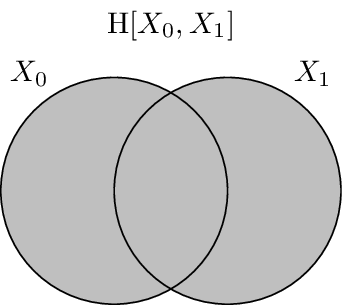
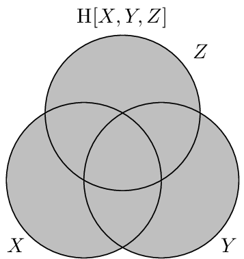

.. entropy.rst
.. py:module:: dit.algorithms.entropy2

*******
Entropy
*******

This is a general entropy function, handling conditional joint entropy.

.. math::

   \H[X_{0:n} | Y_{0:m}] =  -\sum_{\substack{x_{0:n} \in X_{0:n} \\ y_{0:m} \in Y_{0:m}}} p(x_{0:n}, y_{0:m}) \log_2 p(x_{0:n}|y_{0:m})

.. todo::

   Add some clever examples.

.. autofunction:: dit.algorithms.entropy2.entropy
