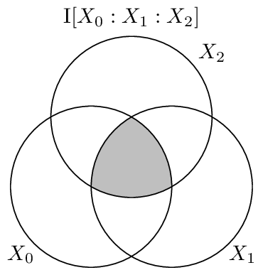

.. coinformation.rst
.. py:module:: dit.multivariate.coinformation

**************
Co-Information
**************

The co-information :cite:`Bell2003` is one generalization of the mutual
information to multiple variables. The co-information quantifies the amount of
infomration that *all* variables participate in. It is defined via an
inclusion/exclusion sum:

.. math::

   \I[X_{0:n}] &= -\sum_{y \in \mathcal{P}(\{0..n\})} (-1)^{|y|} \H[X_y] \\
               &= \sum_{x_{0:n} \in X_{0:n}} p(x_{0:n}) \log_2 \prod_{y \in \mathcal{P}(\{0..n\})} p(y)^{(-1)^{|y|}}

It is clear that the co-information measures the "center-most" atom of the
diagram only, which is the only atom to which every variable contributes. To
exemplifying this, consider "giant bit" distributions:

.. ipython::

   In [1]: from dit import Distribution as D

   In [2]: from dit.multivariate import coinformation as I

   @doctest float
   In [3]: [ I(D(['0'*n, '1'*n], [1/2, 1/2])) for n in range(2, 6) ]
   Out[3]: [1.0, 1.0, 1.0, 1.0]

This verifies intuition that the entire one bit of the distribution's entropy is
condensed in a single atom. One notable property of the co-information is that
for :math:`n \geq 3` it can be negative. For example:

.. ipython::

   In [4]: from dit.example_dists import Xor

   In [5]: d = Xor()

   @doctest float
   In [6]: I(d)
   Out[6]: -1.0

Based on these two examples one might get the impression that the co-information
is positive for "redundant" distributions and negative for "synergistic"
distributions. This however is not true --- consider the four-variable parity
distribution:

.. ipython::

   In [7]: from dit.example_dists import n_mod_m

   In [8]: d = n_mod_m(4, 2)

   @doctest float
   In [9]: I(d)
   Out[9]: 1.0

Meaning that the co-information is positive for both the most redundant
distribution, the giant bit, and the most synergistic, the parity. Therefore the
coinformation can not be used to measure redundancy or synergy.

.. note::

   Correctly measuring redundancy and synergy is an ongoing problem. See
   :cite:`Griffith2013` and references therein for the current status of the
   problem.

Visualization
=============

The co-information can be visuallized on an i-diagram as below, where only the
centermost atom is shaded:

.. autofunction:: coinformation
