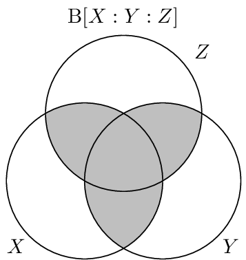

.. dual_total_correlation.rst
.. py:module:: dit.multivariate.binding_information

**********************
Dual Total Correaltion
**********************

The dual total correlation :cite:, or binding information :cite:`Abdallah2012`, is yet another generalization of the mutual information. It is the amount of information that is shared among the variables. It is defined as:

.. math::

   \B[X_{0:n}] &= \H[X_{0:n}] - \sum \H[X_i | X_{\{0..n\}/i}] \\
               &= - \sum_{x_{0:n} \in X_{0:n}} p(x_{0:n}) \log_2 \frac{p(x_{0:n})}{\prod p(x_i|x_{\{0:n\}/i})}

In a sense the binding information captures the same information that the :doc:`total_correlation` does, in that both measures are zero or non-zero together. However, the two measures take on very different quantitative values for different distributions. By way of example, the type of distribution that maximizes the total correlation is a "giant bit":

.. ipython::

   In [1]: from dit.multivariate import binding_information, total_correlation

   In [2]: d = dit.Distribution(['000', '111'], [1/2, 1/2])

   @doctest float
   In [3]: total_correlation(d)
   Out[3]: 2.0

   @doctest float
   In [4]: binding_information(d)
   Out[4]: 1.0

For the same distribution, the dual total correlation takes on a relatively low value. On the other hand, the type of distribution that maximizes the dual total correlation is a "parity" distribution:

.. ipython::

   In [5]: from dit.example_dists import n_mod_m

   In [6]: d = n_mod_m(3, 2)

   @doctest float
   In [7]: total_correlation(d)
   Out[7]: 1.0

   @doctest float
   In [8]: binding_information(d)
   Out[8]: 2.0

Relationship to Other Measures
==============================

The dual total correlation obeys particular bounds related to both the :doc:`entropy` and the :doc:`total_correlation`:

.. math::

   0 \leq & \B[X_{0:n}] \leq \H[X_{0:n}] \\
   \frac{\T[X_{0:n}]}{n-1} \leq & \B[X_{0:n}] \leq (n-1)\T[X_{0:n}]

Visualization
=============

The binding information, as seen below, consists equally of the information shared among the variables.

API
===

.. autofunction:: dual_total_correlation
