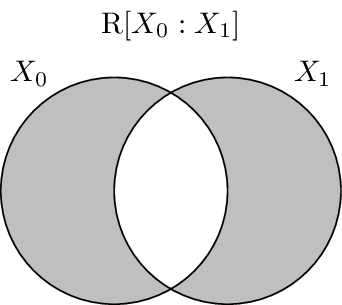
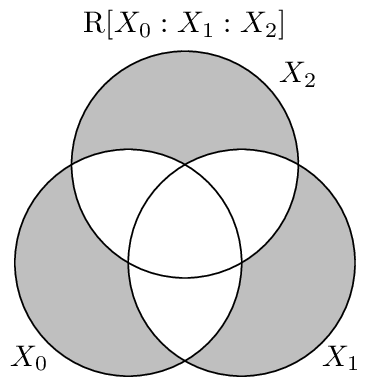

.. residual_entropy.rst
.. py:currentmodule:: dit.algorithms.binding_information

****************
Residual Entropy
****************

The residual entropy, or erasure entropy, is a dual to the binding information.

.. math::

   \R[X_{0:n}] &= \sum \H[X_i | X_{\{0..n\}/i}] \\
               &= - \sum_{x_{0:n} \in X_{0:n}} p(x_{0:n}) \log_2 \prod p(x_i|x_{\{0:n\}/i})

.. todo::

   Add discussion, history (erasure entropy)

.. todo::

   Add some good examples.

.. autofunction:: dit.algorithms.binding_information.residual_entropy
