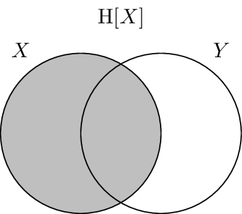
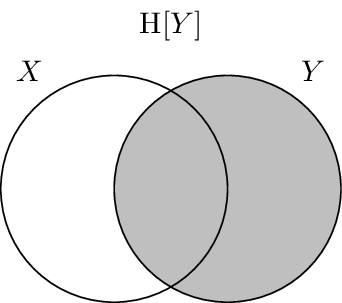
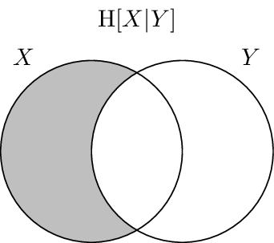
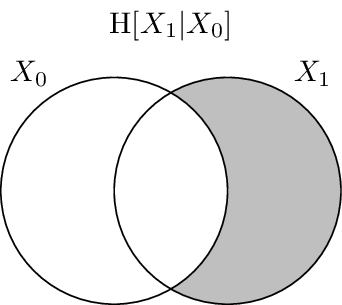
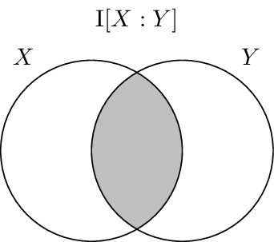

.. shannon.rst
.. py:module:: dit.shannon.shannon

**********************
Basic Shannon measures
**********************

The information on this page is drawn from the fantastic text book **Elements of
Information Theory** by Cover and Thomas :cite:`Cover2006`. Other good choices
are **Information Theory, Inference and Learning Algorithms** by MacKay
:cite:`MacKay2003` and **Information Theory and Network Coding** by Yeung
:cite:`Yeung2008`.

Entropy
=======

The entropy measures how much information is in a random variable :math:`X`.

.. math::

   \H[X] = -\sum_{x \in X} p(x) \log_2 p(x)

What do we mean by "how much information"? Basically, we mean the average number
of yes-no questions one would have to ask to determine an outcome from the
distribution. In the simplest case, consider a sure thing:

.. ipython::

   In [1]: from __future__ import division

   In [2]: d = dit.Distribution(['H'], [1])

   @doctest float
   In [3]: dit.shannon.entropy(d)
   Out[3]: 0.0

So is we know that the outcome from our distribution will always be `H`, we have
to ask zero questions to figure that out. If however we have a fair coin:

.. ipython::

   In [4]: d = dit.Distribution(['H', 'T'], [1/2, 1/2])

   @doctest float
   In [5]: dit.shannon.entropy(d)
   Out[5]: 1.0

The entropy tells us that we must ask one question to determine whether an `H`
or `T` was the outcome of the coin flip. Now what if there are three outcomes?
Let's consider the following situation:

.. ipython::

   In [6]: d = dit.Distribution(['A', 'B', 'C'], [1/2, 1/4, 1/4])

   @doctest float
   In [7]: dit.shannon.entropy(d)
   Out[7]: 1.5

Here we find that the entropy is 1.5 bits. How do we ask one and a half
questions on average? Well, if our first question is "was it `A`?" and it is
true, then we are done, and that occurs half the time. The other half of the
time we need to ask a follow up question: "was it `B`?". So half the time we
need to ask one question, and the other half of the time we need to ask two
questions. In other words, we need to ask 1.5 questions on average.

Joint Entropy
-------------

The entropy of multiple variables is computed in a similar manner:

.. math::

   \H[X_{0:n}] = -\sum_{x_{0:n} \in X_{0:n}} p(x_{0:n}) \log_2 p(x_{0:n})

Its intuition is also the same: the average number of binary questions required
to identify a joint event from the distribution.

.. autofunction:: entropy

Conditional Entropy
===================

The conditional entropy is the amount of information in variable :math:`X`
beyond that which is in variable :math:`Y`:

.. math::

   \H[X|Y] = -\sum_{x \in X, y \in Y} p(x, y) \log_2 p(x|y)

As a simple example, consider two identical variables:

.. ipython::

   In [8]: d = dit.Distribution(['HH', 'TT'], [1/2, 1/2])

   @doctest float
   In [9]: dit.shannon.conditional_entropy(d, [0], [1])
   Out[9]: 0.0

We see that knowing the second variable tells us everything about the first,
leaving zero entropy. On the other end of the spectrum, two independent
variables:

.. ipython::

   In [10]: d = dit.Distribution(['HH', 'HT', 'TH', 'TT'], [1/4]*4)

   @doctest float
   In [11]: dit.shannon.conditional_entropy(d, [0], [1])
   Out[11]: 1.0

Here, the second variable tells us nothing about the first so we are left with
the one bit of information a coin flip has.

.. autofunction:: conditional_entropy

Mutual Information
==================

The mutual information is the amount of information shared by :math:`X` and
:math:`Y`:

.. math::

   \I[X:Y] &= \H[X,Y] - \H[X|Y] - \H[Y|X] \\
           &= \H[X] + \H[Y] - \H[X,Y] \\
           &= \sum_{x \in X, y \in Y} p(x, y) \log_2 \frac{p(x, y)}{p(x)p(y)}

The mutual information is symmetric:

.. math::

   \I[X:Y] = \I[Y:X]

Meaning that the information that :math:`X` carries about :math:`Y` is equal to
the information that :math:`Y` carries about :math:`X`. The entropy of :math:`X`
can be decomposed into the information it shares with :math:`Y` and the
information it doesn't:

.. math::

   \H[X] = \I[X:Y] + \H[X|Y]

.. seealso::

   The mutual information generalized to the multivariate case in three
   different ways:

   :py:func:`dit.multivariate.coinformation.coinformation`
      Generalized as the information which *all* variables contribute to.

   :py:func:`dit.multivariate.total_correlation.total_correlation`
      Generalized as the sum of the information in the individual variables
      minus the joint.

   :py:func:`dit.multivariate.binding_information.binding_information`
      Generalized as the joint minus the entropy of each variable conditioned on
      the others.

.. autofunction:: mutual_information

Visualization of Information
============================

It has been shown that there is a correspondence between set-theoretic measures
and information-theoretic measures. The entropy is equivalent to set
cardinality, mutual information to set intersection, and conditional entropy to
set difference. Because of this we can use Venn-like diagrams to represent the
information in and shared between random variables. These diagrams are called
*information diagrams* or i-diagrams for short.

.. image:: ../images/idiagrams/h_xy.png
   :alt: The joint entropy :math:`\H[X_0,X_1]`
   :width: 342px
   :align: center

