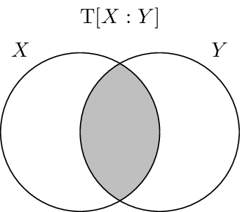
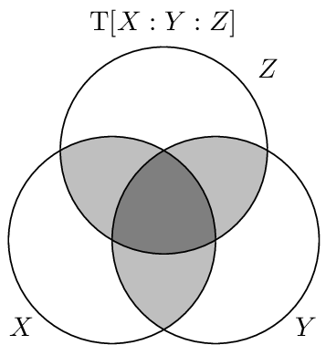

.. total_correlation.rst
.. py:module :: dit.algorithms.total_correlation

*****************
Total Correlation
*****************

The total correlation :cite:`Watanabe1960`, denoted :math:`\T`, also known as
the multi-information or integration, is one generalization of the mutual
information. It is defined as the amount of information each individual variable
carries above and beyond the joint entropy, e.g. the difference between the
whole and the sum of its parts:

.. math::

   \T[X_{0:n}] &= \sum \H[X_i] - \H[X_{0:n}] \\
               &= \sum_{x_{0:n} \in X_{0:n}} p(x_{0:n}) \log_2 \frac{p(x_{0:n})}{\prod p(x_i)}

Two nice features of the total correlation are that it is non-negative and that
it is zero if and only if the random variables :math:`X_{0:n}` are all
independent. Some baseline behavior is good to note also. First its behavior
when applied to "giant bit" distributions:

.. code-block:: python

   >>> from dit import Distribution as D
   >>> from dit.algorithms import total_correlation as T
   >>> [ T(D(['0'*n, '1'*n], [0.5, 0.5])) for n in range(2, 6) ]
   [1.0, 2.0, 3.0, 4.0]

So we see that for giant bit distributions, the total correlation is equal to
one less than the number of variables. The second type of distribution to
consider is general parity distributions:

.. code-block:: python

   >>> from dit.example_dists import n_mod_m
   >>> [ T(n_mod_m(n, 2)) for n in range(3, 6) ]
   [1.0, 1.0, 1.0]
   >>> [ T(n_mod_m(3, m)) for m in range(2, 5) ]
   [1.0, 1.58496250072, 2.0]

Here we see that the total correlation is equal to :math:`\log_2{m}` regardless
of :math:`n`.

.. todo::

   Add more examples, perhaps from real-world usage.

.. autofunction:: dit.algorithms.total_correlation.total_correlation
