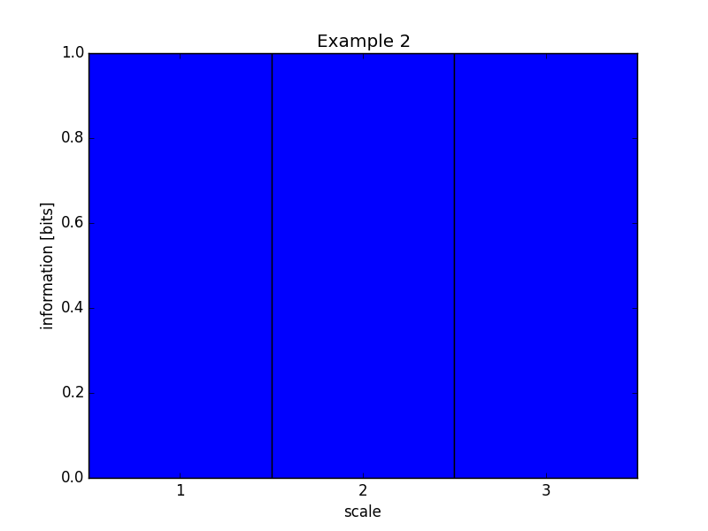
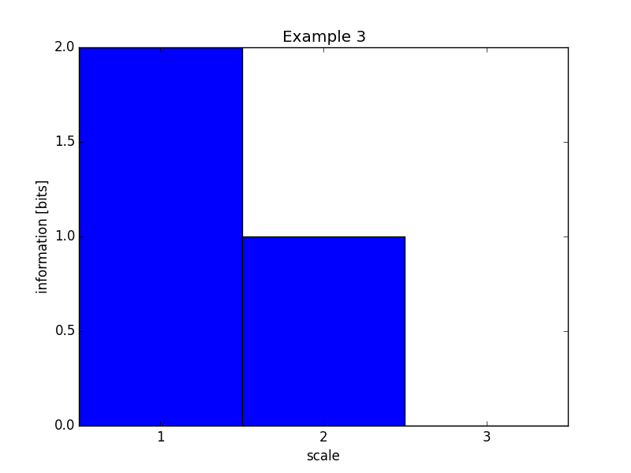
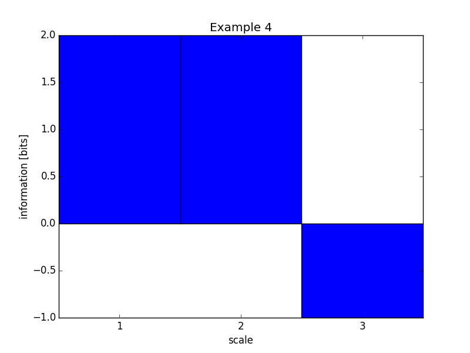
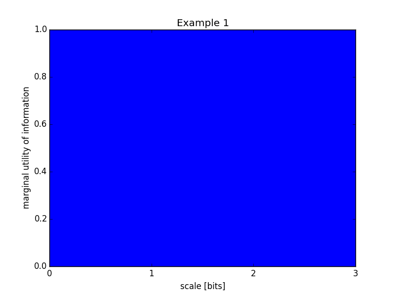
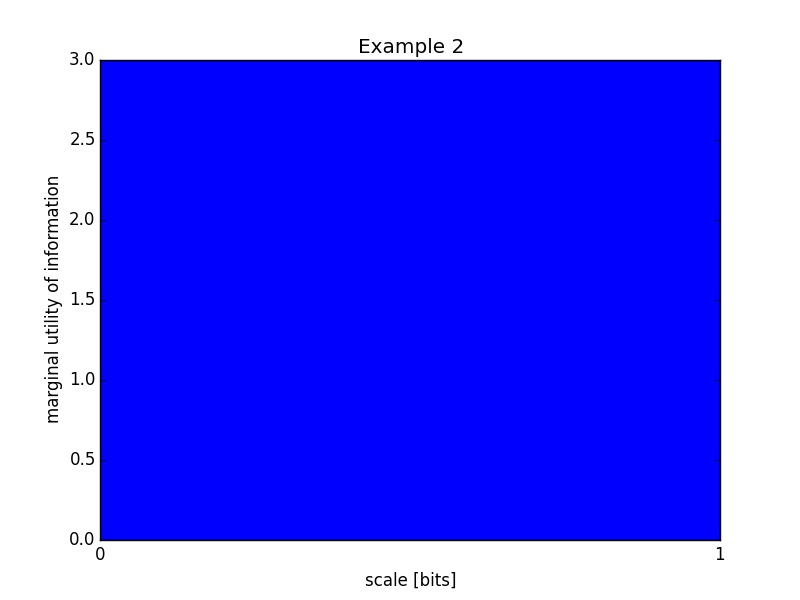
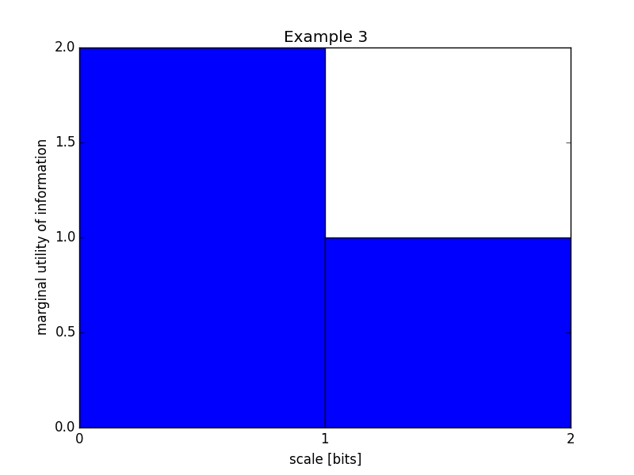
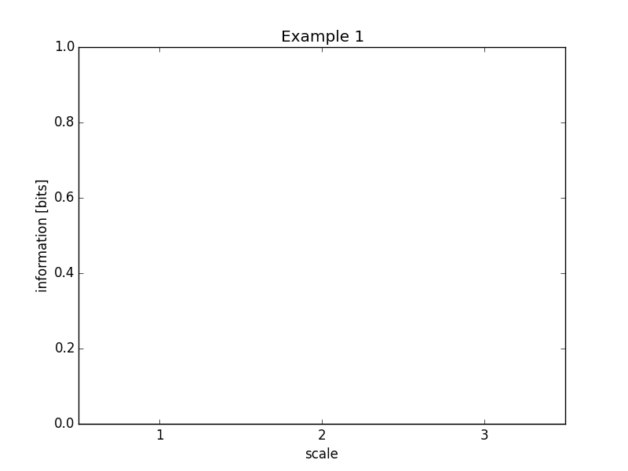
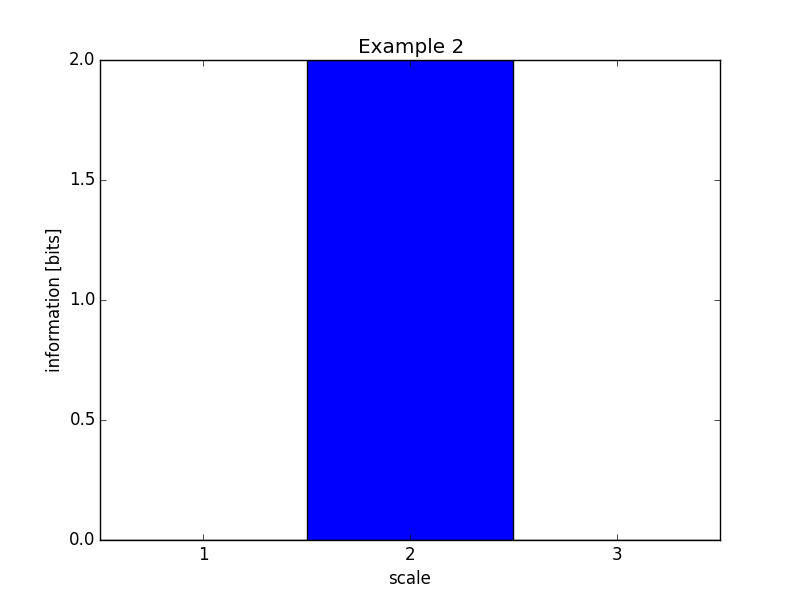
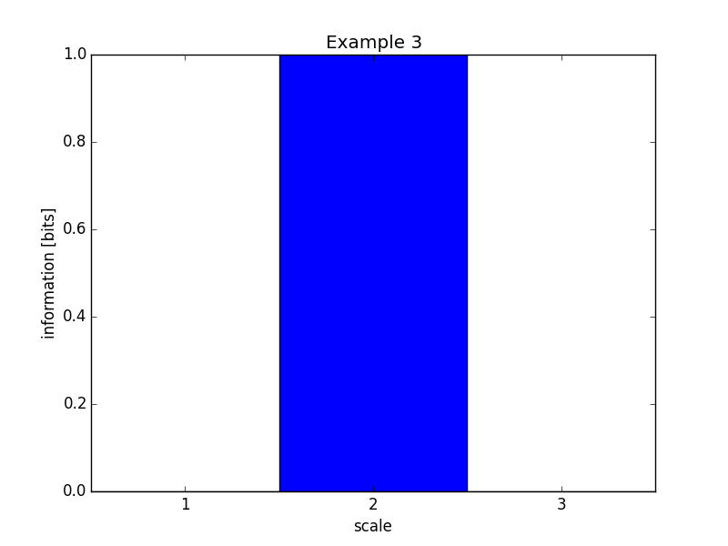
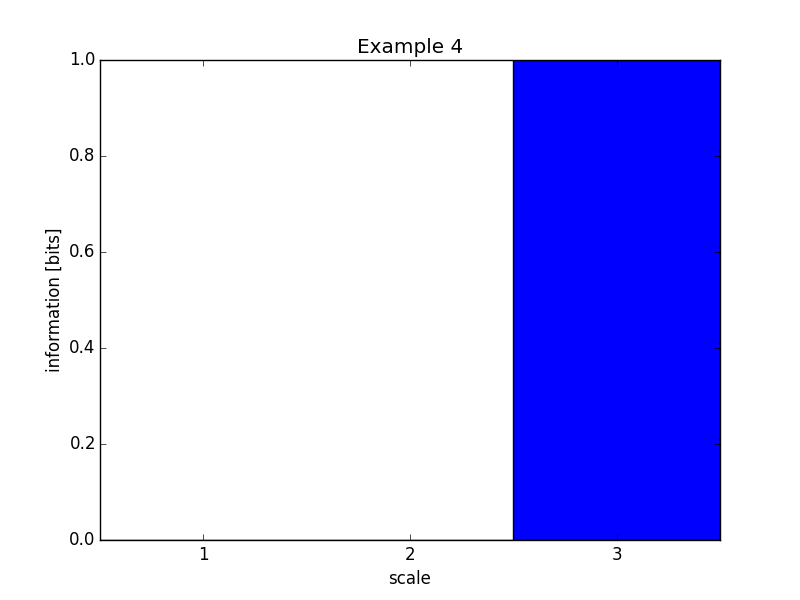

.. profiles.rst
.. py:module:: dit.profiles

********************
Information Profiles
********************

There are several ways to decompose the information contained in a joint distribution. Here, we will demonstrate their behavior using four examples drawn from :cite:`Allen2014`:

.. ipython::

   In [1]: from dit.profiles import *

   In [2]: ex1 = dit.Distribution(['000', '001', '010', '011', '100', '101', '110', '111'], [1/8]*8)

   In [3]: ex2 = dit.Distribution(['000', '111'], [1/2]*2)

   In [4]: ex3 = dit.Distribution(['000', '001', '110', '111'], [1/4]*4)

   In [5]: ex4 = dit.Distribution(['000', '011', '101', '110'], [1/4]*4)

The I-diagrams for these four examples can be computed thusly:

.. ipython::

   In [6]: from dit.algorithms import ShannonPartition

   In [7]: print(ShannonPartition(ex1))
   +----------+--------+
   | measure  |  bits  |
   +----------+--------+
   | H[2|0,1] |  1.000 |
   | H[1|0,2] |  1.000 |
   | H[0|1,2] |  1.000 |
   | I[1:2|0] |  0.000 |
   | I[0:1|2] |  0.000 |
   | I[0:2|1] |  0.000 |
   | I[0:1:2] |  0.000 |
   +----------+--------+

   In [8]: print(ShannonPartition(ex2))
   +----------+--------+
   | measure  |  bits  |
   +----------+--------+
   | H[2|0,1] |  0.000 |
   | H[1|0,2] |  0.000 |
   | H[0|1,2] |  0.000 |
   | I[1:2|0] |  0.000 |
   | I[0:1|2] |  0.000 |
   | I[0:2|1] |  0.000 |
   | I[0:1:2] |  1.000 |
   +----------+--------+

   In [9]: print(ShannonPartition(ex3))
   +----------+--------+
   | measure  |  bits  |
   +----------+--------+
   | H[2|0,1] |  1.000 |
   | H[1|0,2] |  0.000 |
   | H[0|1,2] |  0.000 |
   | I[1:2|0] |  0.000 |
   | I[0:1|2] |  1.000 |
   | I[0:2|1] |  0.000 |
   | I[0:1:2] |  0.000 |
   +----------+--------+

   In [10]: print(ShannonPartition(ex4))
   +----------+--------+
   | measure  |  bits  |
   +----------+--------+
   | H[2|0,1] |  0.000 |
   | H[1|0,2] |  0.000 |
   | H[0|1,2] |  0.000 |
   | I[1:2|0] |  1.000 |
   | I[0:1|2] |  1.000 |
   | I[0:2|1] |  1.000 |
   | I[0:1:2] | -1.000 |
   +----------+--------+

Complexity Profile
==================

The complexity profile is simply the amount of information at scale :math:`\geq k` of each "layer" of the I-diagram :cite:`Baryam2004`.

Consider example 1, which contains three independent bits. Each of these bits are in the outermost "layer" of the i-diagram, and so the information in the complexity profile is all at layer 1:

.. ipython::

   In [11]: ComplexityProfile(ex1).draw();

.. image:: images/profiles/complexity_profile_example_1.png
   :alt: The complexity profile for example 1
   :width: 500
   :align: center

Whereas in example 2, all the information is in the center, and so each scale of the complexity profile picks up that one bit:

.. ipython::

   In [12]: ComplexityProfile(ex2).draw();

Both bits in example 3 are at a scale of at least 1, but only the shared bit persists to scale 2:

.. ipython::

   In [13]: ComplexityProfile(ex3).draw();

Finally, example 4 (where each variable is the ``exclusive or`` of the other two):

.. ipython::

   In [14]: ComplexityProfile(ex4).draw();

Marginal Utility of Information
===============================

The marginal utility of information (MUI) :cite:`Allen2014` takes a different approach. It asks, given an amount of information :math:`\I[d : \{X\}] = y`, what is the maximum amount of information one can extract using an auxilliary variable :math:`d` as measured by the sum of the pairwise mutual informations, :math:`\sum \I[d : X_i]`. The MUI is then the rate of this maximum as a function of :math:`y`.

For the first example, each bit is independent and so basically must be extracted independently. Thus, as one increases :math:`y` the maximum amount extracted grows equally:

.. ipython::

   In [15]: MUIProfile(ex1).draw();

In the second example, there is only one bit total to be extracted, but it is shared by each pairwise mutual information. Therefore, for each increase in :math:`y` we get a threefold increase in the amount extracted:

.. ipython::

   In [16]: MUIProfile(ex2).draw();

For the third example, for the first one bit of :math:`y` we can pull from the shared bit, but after that one must pull from the independent bit, so we see a step in the MUI profile:

.. ipython::

   In [17]: MUIProfile(ex3).draw();

Lastly, the ``xor`` example:

.. ipython::

   In [18]: MUIProfile(ex4).draw();

.. image:: images/profiles/mui_profile_example_4.png
   :alt: The MUI profile for example 4
   :width: 500
   :align: center

Schneidman Profile
==================

Also known as the *connected information* or *network informations*, the Schneidman profile exposes how much information is learned about the distribution when considering :math:`k`-way dependencies :cite:`Schneidman2003`. In all the following examples, each individual marginal is already uniformly distributed, and so the connected information at scale 1 is 0.

In the first example, all the random variables are independent already, so fixing marginals above :math:`k=1` does not result in any change to the inferred distribution:

.. ipython::

   In [19]: SchneidmanProfile(ex1).draw();

In the second example, by learning the pairwise marginals, we reduce the entropy of the distribution by two bits (from three independent bits, to one giant bit):

.. ipython::

   In [20]: SchneidmanProfile(ex2).draw();

For the third example, learning pairwise marginals only reduces the entropy by one bit:

.. ipython::

   In [21]: SchneidmanProfile(ex3).draw();

And for the ``xor``, all bits appear independent until fixing the three-way marginals at which point one bit about the distribution is learned:

.. ipython::

   In [22]: SchneidmanProfile(ex4).draw();

