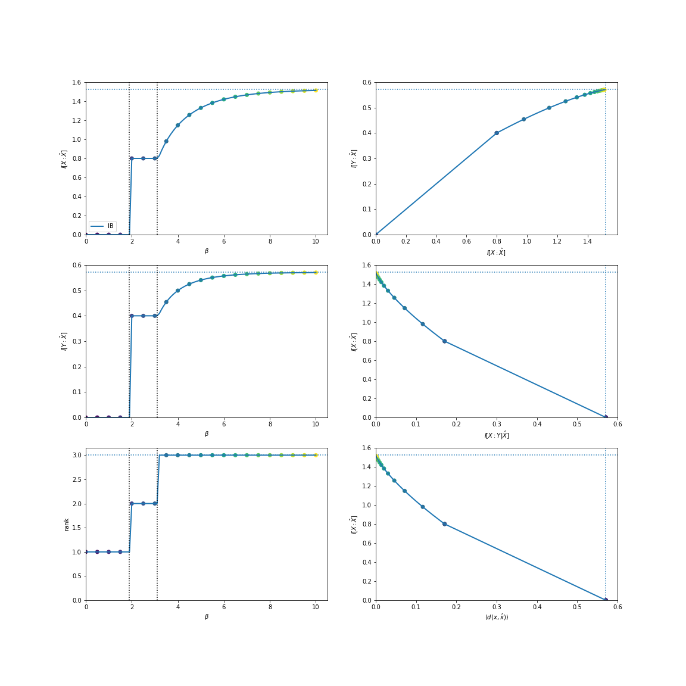
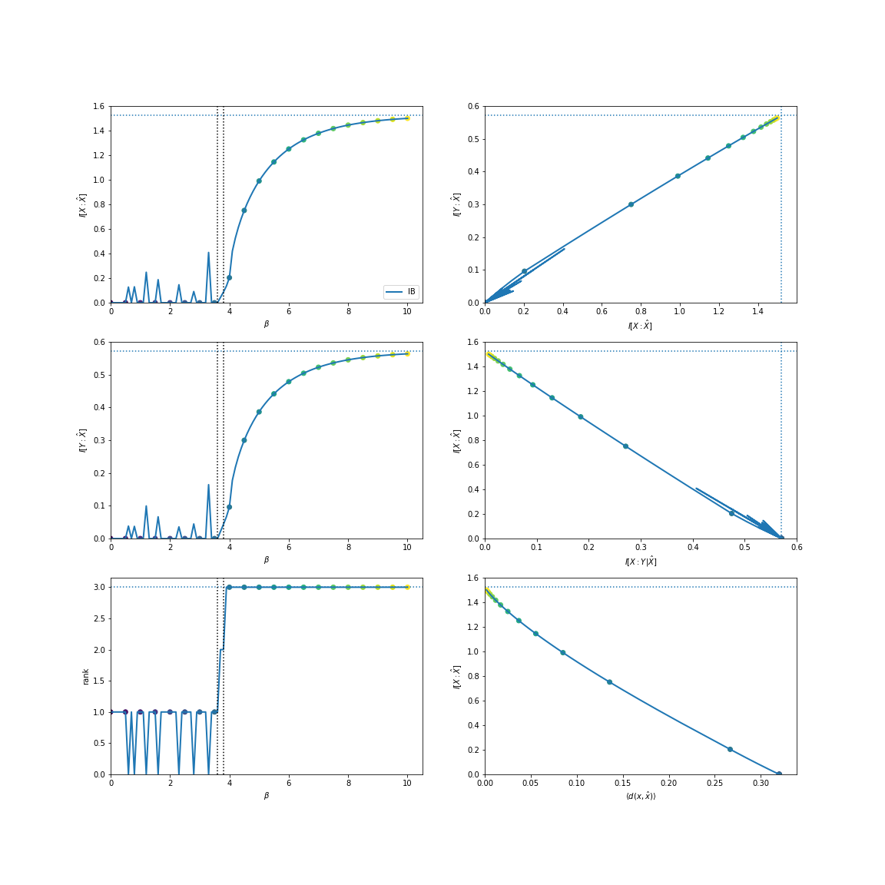

.. rate_distortion.rst
.. py:module:: dit.rate_distortion

Rate Distortion Theory
======================

.. note::

   We use :math:`p` to denote fixed probability distributions, and :math:`q` to denote probability distributions that are optimized.

Rate-distortion theory :cite:`Cover2006` is a framework for studying optimal lossy compression. Given a distribution :math:`p(x)`, we wish to find :math:`q(\hat{x}|x)` which compresses :math:`X` as much as possible while limiting the amount of user-defined distortion, :math:`d(x, \hat{x})`. The minimum rate (effectively, code book size) at which :math:`X` can be compressed while maintaining a fixed distortion is known as the rate-distortion curve:

.. math::

   R(D) = \min_{q(\hat{x}|x), \langle d(x, \hat{x}) \rangle = D} \I{X : \hat{X}}

By introducing a Lagrange multiplier, we can transform this constrained optimization into an unconstrained one:

.. math::

   \mathcal{L} = \I{X : \hat{X}} + \beta \langle d(x, \hat{x}) \rangle

where minimizing at each :math:`\beta` produces a point on the curve.

Example
-------

It is known that under the Hamming distortion (:math:`d(x, \hat{x}) = \left[ x \neq \hat{x} \right]`) the rate-distortion function for a biased coin has the following solution: :math:`R(D) = \H{p} - \H{D}`:

.. ipython::

   In [1]: from dit.rate_distortion import RDCurve

   In [2]: d = dit.Distribution(['0', '1'], [1/2, 1/2])

   @savefig rate_distortion.png width=1000 align=center
   In [3]: RDCurve(d, beta_num=26).plot();

Information Bottleneck
======================

The information bottleneck :cite:`tishby2000information` is a form of rate-distortion where the distortion measure is given by:

.. math::

   d(x, \hat{x}) = D\left[~p(Y | x)~\mid\mid~q(Y | \hat{x})~\right]

where :math:`D` is an arbitrary divergence measure, and :math:`\hat{X} - X - Y` form a Markov chain. Traditionally, :math:`D` is the :doc:`measures/divergences/kullback_leibler_divergence`, in which case the average distortion takes a particular form:

.. math::

   \langle d(x, \hat{x}) \rangle &= \sum_{x, \hat{x}} q(x, \hat{x}) \DKL{ p(Y | x) || q(Y | \hat{x}) } \\
                                 &= \sum_{x, \hat{x}} q(x, \hat{x}) \sum_{y} p(y | x) \log_2 \frac{p(y | x)}{q(y | \hat{x})} \\
                                 &= \sum_{x, \hat{x}, y} q(x, \hat{x}, y) \log_2 \frac{p(y | x) p(x) p(y) q(\hat{x})}{q(y | \hat{x}) p(x) p(y) q(\hat{x})} \\
                                 &= \sum_{x, \hat{x}, y} q(x, \hat{x}, y) \log_2 \frac{p(y | x) p(x)}{p(x) p(y)} \frac{p(y)q(\hat{x})}{q(y | \hat{x}) q(\hat{x})} \\
                                 &= \I{X : Y} - \I{\hat{X} : Y}

Since :math:`\I{X : Y}` is constant over :math:`q(\hat{x} | x)`, it can be removed from the optimization. Furthermore,

.. math::

   \I{X : Y} - \I{\hat{X} : Y} &= (\I{X : Y | \hat{X}} + \I{X : Y : \hat{X}}) - (\I{Y : \hat{X} | X} + \I{X : Y : \hat{X}}) \\
                               &= \I{X : Y | \hat{X}} - \I{Y : \hat{X} | X} \\
                               &= \I{X : Y | \hat{X}}

where the final equality is due to the Markov chain. Due to all this, Information Bottleneck utilizes a "relevance" term, :math:`\I{\hat{X} : Y}`, which replaces the average distortion in the Lagrangian:

.. math::

   \mathcal{L} = \I{X : \hat{X}} - \beta \I{\hat{X} : Y}
   ~.

Though :math:`\I{X : Y | \hat{X}}` is the most simplified form of the average distortion, it is faster to compute :math:`\I{\hat{X} : Y}` during optimization.

Example
-------

Consider this distribution:

.. ipython::

   In [4]: d = dit.Distribution(['00', '02', '12', '21', '22'], [1/5]*5)

There are effectively three features that the fist index, :math:`X`, has regarding the second index, :math:`Y`. We can find them using the standard information bottleneck:

.. ipython::
   :verbatim:

   In [5]: from dit.rate_distortion import IBCurve

   In [6]: IBCurve(d, beta_num=26).plot();

We can also find them utilizing the total variation:

.. ipython::
   :verbatim:

   In [7]: from dit.divergences.pmf import variational_distance

   In [8]: IBCurve(d, divergence=variational_distance).plot();

.. note::

   The spiky behavior at low :math:`\beta` values is due to numerical imprecision.

APIs
====

.. autoclass:: RDCurve

.. autoclass:: IBCurve
